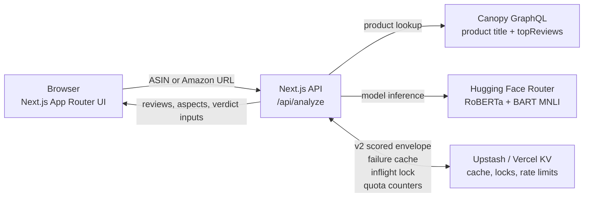

# Amazon Review Sentiment Analyzer

This is a deployed Next.js case study that turns an Amazon ASIN or product URL into a recruiter-legible sentiment read: it fetches real product reviews, scores each review with complementary NLP models, highlights model disagreement, estimates product-level aspects, and produces a shopper-friendly verdict that can be shared by URL. The project started as a Python/Kaggle sentiment notebook and was rebuilt into a production-style web app with live APIs, caching, rate limits, and explicit ML limitations.

**Live demo:** https://sentiment-amazon-analyzer.vercel.app

Try a cached sample for instant results: `B000E7L2R4`, `B00032G1S0`, `B01B57DVNE`, `B017835JPC`, or `B0C2FV4W2S`.

## Architecture



## ML Methodology

- **VADER:** local lexical sentiment scoring runs inside the API route for every review. It is fast, deterministic, and useful as a rule-based baseline.
- **RoBERTa:** each review is sent through Hugging Face's `cardiffnlp/twitter-roberta-base-sentiment-latest` model to get negative, neutral, and positive probabilities.
- **Zero-shot NLI aspects:** each review is also checked with `facebook/bart-large-mnli` against five candidate labels: taste & flavor, quality, value for money, packaging & shipping, and ease of use. An aspect counts as mentioned when the NLI score is at least `0.7`, and product-level aspects are shown only when at least two reviews mention them.
- **Verdict math:** RoBERTa polarity is `positive - negative`. The product score is `round((mean(polarity) + 1) * 50)`, mapped to 0-100 with labels from "Mostly negative" through "Loved it". Model agreement is the share of reviews where VADER compound and RoBERTa polarity land on the same side of neutral.

## Engineering Decisions

- **Cache v2 envelope:** successful analyses are stored as `asin:v2:<ASIN>:scored` with `{ reviews, productTitle, aspects, analyzedAt }`, so cache hits can render the full result without recomputing or losing the product title.
- **Per-IP rate limit:** cache misses are limited to five requests per hour per IP. Cache hits bypass this path so the example gallery stays fast and inexpensive.
- **Inflight lock:** `asin:v1:<ASIN>:inflight` prevents concurrent requests for the same product from burning duplicate Canopy and Hugging Face quota.
- **Circuit breaker:** monthly Canopy usage is counted in KV and capped at 90 lookups to protect the free-tier budget.
- **Fail-soft aspects:** the main sentiment response can still succeed if zero-shot aspect detection times out or returns an unexpected shape; the UI simply hides the aspect section.
- **Share routes:** `/p/[asin]` preloads the same analysis UI and share buttons copy that route. Uncached shared ASINs intentionally run through the visitor's normal cache-miss rate limit.

## Limitations

- The API analyzes up to 8 reviews per product, so results are directional rather than statistically complete.
- Aspect polarity is review-level attribution: if a review mentions packaging and is overall positive, packaging inherits that review's RoBERTa polarity. There is no sentence-level aspect sentiment.
- Canopy index coverage varies by ASIN; some valid Amazon products do not return enough indexed reviews to analyze.
- Uncached shared ASIN routes consume the visitor's rate-limit budget because they need fresh Canopy and Hugging Face calls.
- The app does not generate LLM summaries, store persistent user accounts, or claim ground-truth product quality.

## Local Setup

Install dependencies:

```bash
npm install
```

Create `.env.local` with:

```bash
HF_API_KEY=hf_xxxxxxxxxxxx
CANOPY_API_KEY=xxxxxxxxxxxx
KV_REST_API_URL=https://...
KV_REST_API_TOKEN=xxxxxxxxxxxx
KV_REST_API_READ_ONLY_TOKEN=xxxxxxxxxxxx
```

Run the development server:

```bash
npm run dev
```

Then open http://localhost:3000 and submit an ASIN or Amazon product URL.

Run tests and production build checks:

```bash
npm test
npm run build
```

## Backstory

The legacy `Sentiment_Amazon.py` script is still present as project history: it scores the Kaggle Amazon Fine Food Reviews dataset with VADER and RoBERTa and generates a Plotly scatter plot. The current app setup is the Next.js flow above; the Python script is optional context, not required for the deployed product.
